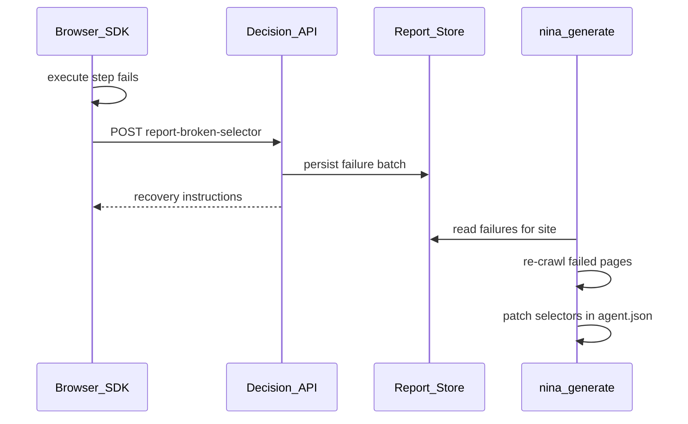

# NINA recovery loop — broken selectors

When the browser executor cannot resolve a contract selector, it reports the failure so the generator and site owners can heal the contract.

## Flow



## Report payload

Schema: [`schemas/report-broken-selector.schema.json`](../schemas/report-broken-selector.schema.json)

Required fields:

- `siteId`, `contractVersion`, `pageUrl`, `failures[]`
- Each failure: `actionId`, `stepIndex`, `op`, `reason` (`not_found` | `not_visible` | `not_interactable` | `timeout`)

Optional: `snapshot` (headings, visible labels) for generator DOM re-analysis.

## API recovery response

The API returns instructions such as:

- `no_match` with `suggestion` for manual fallback (includes `nina-generate` heal command)
- `show_message` explaining the UI may have changed

### Export reports from demo API

```powershell
curl http://127.0.0.1:8000/v1/reports/export > reports.json
# optional filter: /v1/reports/export?siteId=dhaaga-thread
```

## Generator heal loop

### Full regen + heal (re-crawl sitemap, patch selectors)

```powershell
nina-generate contracts/examples --heal-from reports.json
```

When `dist/agent.json` already exists, heal patches that contract (bumps patch version, e.g. `1.0.0` → `1.0.1`).

### Heal-only (fast patch, no sitemap regen)

```powershell
nina-generate contracts/examples --heal-only --heal-from reports.json
```

Re-fetches each `pageUrl` from reports, re-extracts DOM anchors, and updates:

- `selectors.<selectorId>` entries
- Inline `execute.steps[].selector` values

### Pull reports from a running API

```powershell
nina-generate contracts/examples --fetch-reports http://127.0.0.1:8000 --heal-only
```

## Output artifacts

| File | Purpose |
|------|---------|
| `dist/agent.json` | Patched contract (version bumped when selectors change) |
| `dist/agent.heal.json` | Per-failure heal log (`patched` / `unresolved` / `unchanged`) |
| `dist/agent.review.diff` | Unified diff vs previous `agent.json` |

## Heal log example

```json
{
  "healed": [
    {
      "actionId": "search",
      "stepIndex": 0,
      "pageUrl": "https://shop.example/",
      "status": "patched",
      "previous": "#old-q",
      "replacement": "#fresh-q",
      "reason": "not_found"
    }
  ]
}
```

## Operator workflow

1. Users hit broken selectors in production/staging → SDK auto-reports.
2. Export reports from `/v1/reports/export` (or save from logs).
3. Run `nina-generate … --heal-from reports.json` (or `--heal-only`).
4. Review `agent.review.diff` and `agent.heal.json`.
5. Deploy updated `agent.json`; bump notifies embed via `contractVersion`.
