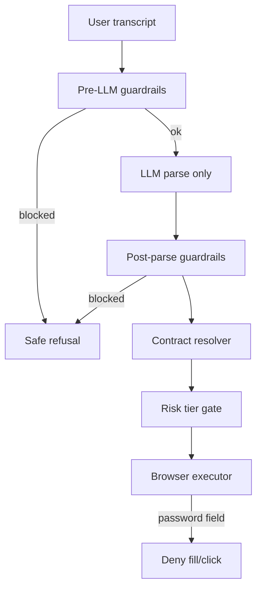

# NINA security model

NINA is a policy-governed action layer on sites you control. It is **not** an autonomous agent with free browser control. This document is for developers and security reviewers.

## What NINA never does

- Accept, store, or log passwords, OTPs, CVV, or API keys from chat
- Auto-fill `input[type=password]` or `autocomplete=current-password` fields
- Execute intents outside the published `agent.json` contract
- Expose LLM system prompts, API keys, or server secrets to the browser
- Perform authentication on behalf of the user (no `login_with_credentials` action)

## Defense in depth



### Layer 1 — Pre-LLM (`nina.guardrails`)

Runs before any model call:

- Credential phrase detection
- `risk.policy.yaml` / `agent.json` `blockPatterns`
- Prompt-injection phrase blocking

Blocked requests return a safe message and typed instructions (`needs_login`, `no_match`, `show_message`). Transcripts are scrubbed before session history.

### Layer 2 — Parse-only LLM

The model returns structured intent + parameters only. It cannot emit DOM selectors or executable instructions.

### Layer 3 — Post-parse guardrails

- Blocked meta-intents (`system`, `admin`, `debug`, …)
- Blocked actions from `risk.blockActions`
- Credential-shaped action parameters

### Layer 4 — Contract resolver

[`contract.py`](../src/nina/contract.py) enforces:

- Action exists in `agent.json`
- Action allowed on current `pageId`
- Confidence threshold
- Auth gates (`needs_login`)
- User confirmation for `risk.confirmActions`

### Layer 5 — Browser executor

[`nina-executor.js`](../sdk/nina-executor.js) refuses `fill` and `click` on password and sensitive autocomplete fields.

## Human-in-the-loop tiers

| Tier | Examples | Gate |
|------|----------|------|
| A — Automatic | search, navigate, view cart | Confidence + page match |
| B — User confirm | checkout, delete account | Panel Yes/No |
| C — Blocked | export data, credential paste | Guardrail / `no_match` |
| D — Admin (future) | regulated workflows | Approval queue |

## Multi-step plans

[`planner.py`](../src/nina/planner.py) queues up to 5 actions per session:

- Stagnation detection (same action repeated 3× cancels plan)
- Auth pause: plan waits until session cookie present
- Confirm pause: high-risk plan steps require confirmation

Schedule via `nina.session.schedule_plan(sessionId, steps)`.

## Sensitive data handling

| Data | Storage | Logs |
|------|---------|------|
| Passwords / OTP | Never | Never |
| Email in chat | Not retained as credential | Scrubbed to `[REDACTED_EMAIL]` |
| Session cookies | Read from browser only | Not logged |
| Transcripts | Session history (scrubbed) | Scrubbed |

## Developer responsibilities

1. Keep `agent.json` minimal (least privilege actions)
2. Maintain `auth.policy.yaml` and `risk.policy.yaml` in Git
3. Never put API keys in `agent.json` or client bundles
4. Use HTTPS and same-origin API endpoints
5. Review guardrail blocks in `/v1/reports` and analytics

## Configuration

Pass security policy at init:

```python
await nina.init({
    "security": {
        "enableCredentialBlock": True,
        "enableInjectionGuard": True,
        "blockPatterns": [...],
        "blockActions": ["export_all_data"],
        "loginUrl": "/login",
    },
})
```

The ecommerce demo loads policy from [`agent.json`](../examples/ecommerce-fastapi/public/agent.json) `risk` and `auth` sections.

## Reporting

- Broken selectors: `POST /v1/report-broken-selector` ([RECOVERY_LOOP.md](RECOVERY_LOOP.md))
- Guardrail blocks: `turn.guardrail.code` in API responses

## Red-team coverage

See [`tests/test_guardrails.py`](../tests/test_guardrails.py) and [`tests/test_red_team.py`](../tests/test_red_team.py).
